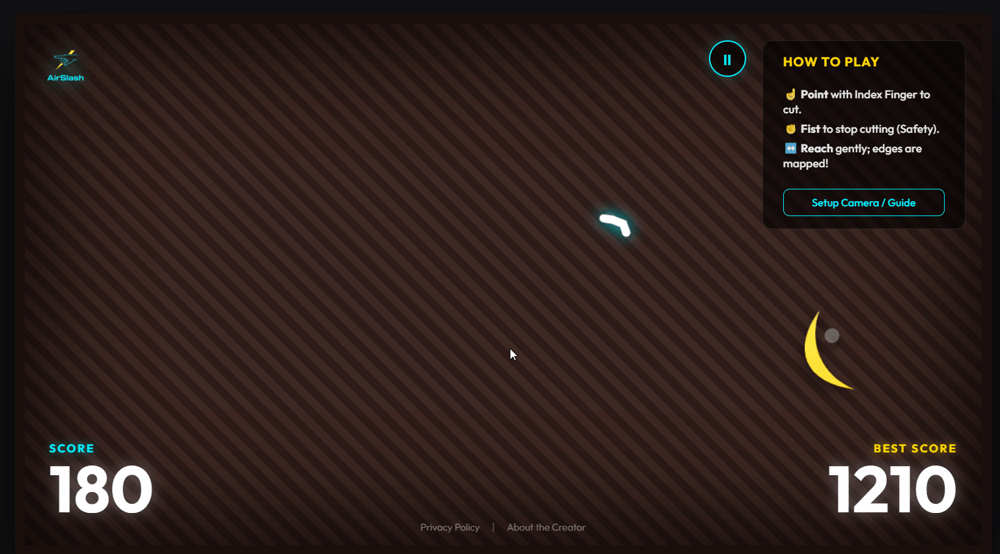

# Michael Balyan
Personal profile README for my GitHub page.

# Hi there, I'm Michael! 👋

  

### 🎓 Education
- **College:** Yerevan State College of Informatics
- **Major:** Software Engineering

### 🛠 Tech Stack
- **Languages:**
&nbsp;

  
  
  
  
  

- **Tools:**
&nbsp;

  &nbsp;&nbsp;
  &nbsp;&nbsp;
  &nbsp;&nbsp;
  &nbsp;&nbsp;
  &nbsp;&nbsp;

### 🌱 I’m currently learning
- Java 
- HTML5
- CSS3
- JavaScript
- C#
- SQL
- MS Word, Excel
- Clean Code principles

### 🎮 My Created Games with AI
- **AirSlash Game**
  

    
  

  

    <a href="https://airslash-game.netlify.app/">Live Demo</a>
  

**AirSlash** is an interactive, web-based action game․ Instead of using a mouse or touchscreen, the player uses **real-time hand tracking** to interact with the game.

Play now clicking **"Live Demo"** in bottom of the gif file.

### 📊 My GitHub Contributions

  

### 📫 How to reach me
- balyan.michael@gmail.com
